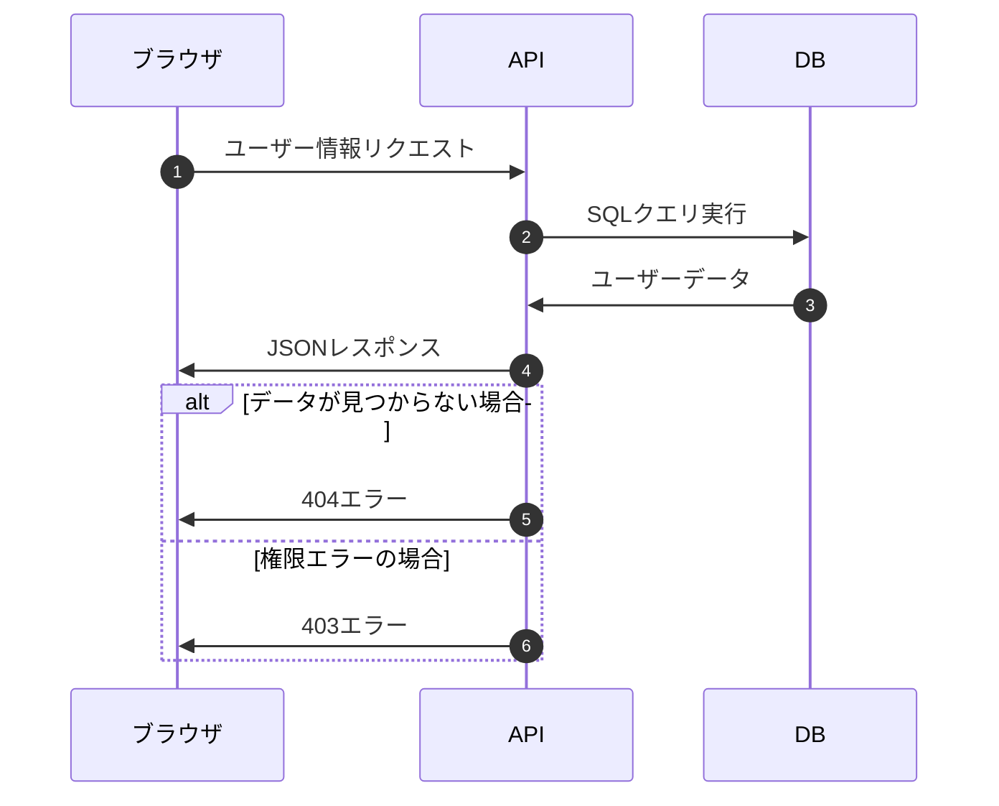
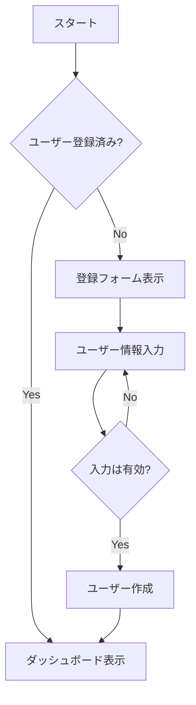
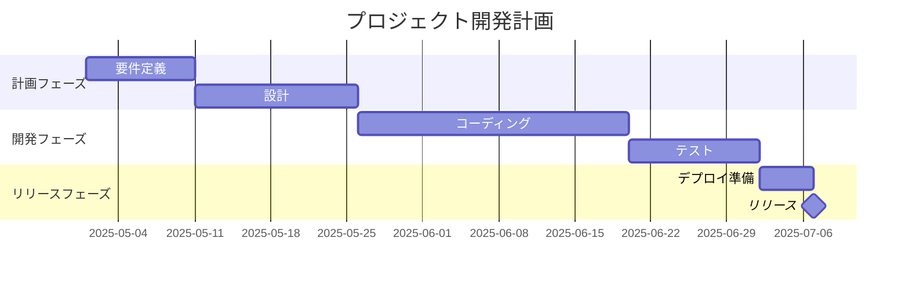
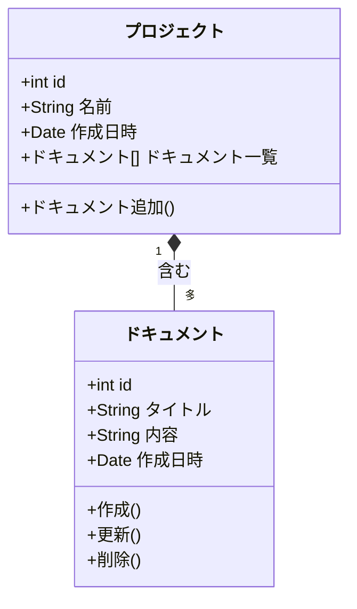
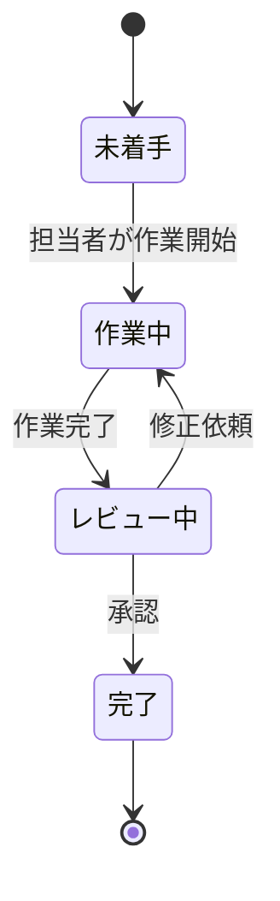
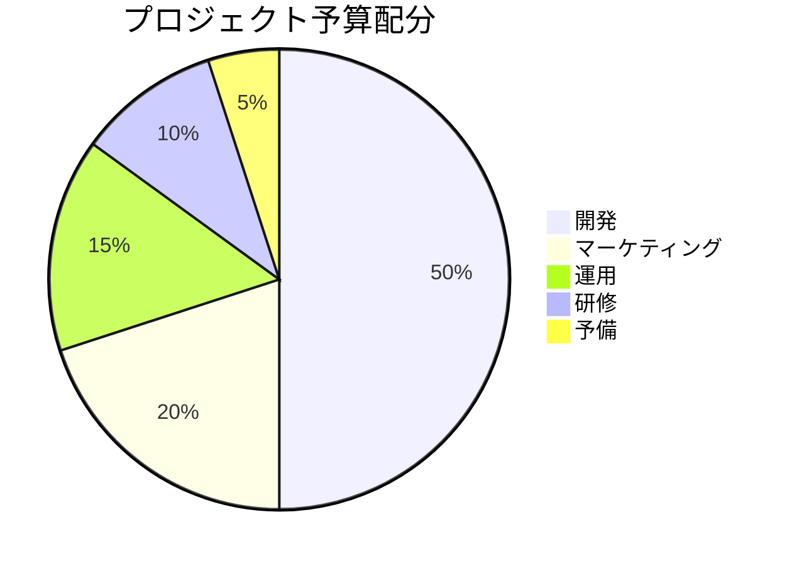

# Mermaidダイアグラム例

このドキュメントにはさまざまなMermaidダイアグラムの例が含まれています。

## シーケンス図（Sequence Diagram）

## フローチャート（Flowchart）

## ガントチャート（Gantt Chart）

## クラス図（Class Diagram）

## 状態図（State Diagram）

## 円グラフ（Pie Chart）

